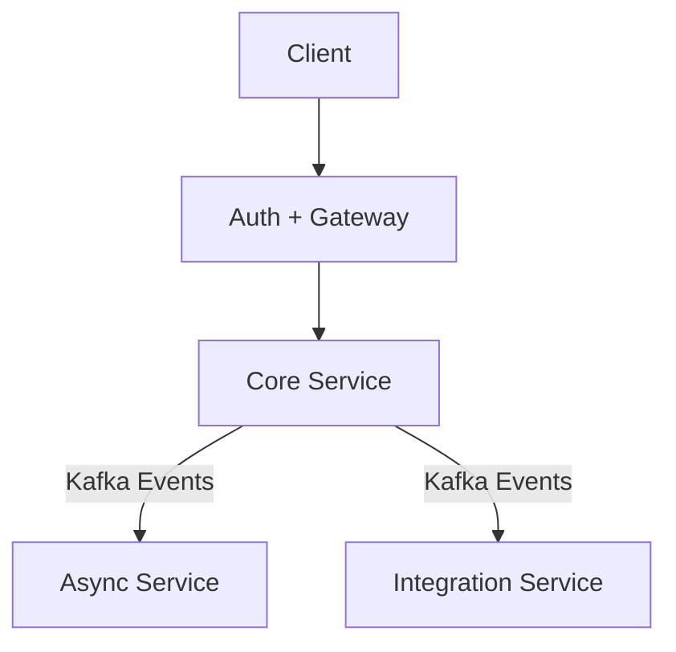

# YourOrder

Микросервисная платформа для управления заказами, каталогом и асинхронными процессами.

Команда:
- Шуклин Александр  
- Степан Терещенко  

---

## 🏗 Архитектура

- Весь трафик проходит через Gateway  
- Взаимодействие сервисов — через Kafka  
- JWT (Access + Refresh, RS256)

# 📦 Сервисы

## 🔐 Auth + Gateway  
**Ответственный:** Шуклин Александр  

- Регистрация / логин  
- JWT (Access + Refresh)  
- Проверка токенов  
- Ролевая модель  
- Проксирование запросов  

Repo:  
`yourorder-auth-gateway`

---

## 🧠 Core Service  
**Ответственный:** Степан Терещенко  

- Каталог  
- Остатки  
- Заказы  
- Публикация событий (`OrderConfirmed`, и т.д.)  
- Реакция на оплату  

Repo:  
`yourorder-core`

---

## ⚙ Async Service  
**Ответственный:** Степан Терещенко  

- Платежи  
- Retry  
- Уведомления  
- Публикация `PaymentCompleted / PaymentFailed`  

Repo:  
`yourorder-async`

---

## 🔗 Integration Service  
**Ответственный:** Шуклин Александр  

- Импорт CSV / XML  
- Публикация `CatalogImported`  
- Внешние интеграции  

Repo:  
`yourorder-integration`

---

# 🚀 Roadmap разработки

## Этап 1 — База (2–3 недели)

- [ ] Auth + JWT
- [ ] Gateway routing
- [ ] Core: Product + Order
- [ ] Kafka подключение
- [ ] Docker окружение

---

## Этап 2 — Workflow заказа (2 недели)

- [ ] Order → OrderConfirmed
- [ ] Async: Payment simulation
- [ ] PaymentCompleted → обновление статуса
- [ ] Уведомление пользователя

---

## Этап 3 — Интеграции (1–2 недели)

- [ ] Import CSV
- [ ] CatalogImported event
- [ ] Обновление каталога

---

## Этап 4 — Улучшения

- [ ] Retry политика
- [ ] Логирование
- [ ] Мониторинг
- [ ] Ролевая модель (расширение)
- [ ] Оптимизация структуры сервисов

---

# 🎯 Цель

Собрать чистую event-driven микросервисную архитектуру  
с безопасной авторизацией и масштабируемой бизнес-логикой.
